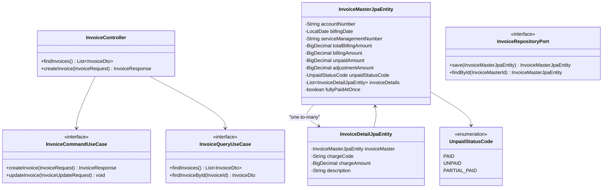
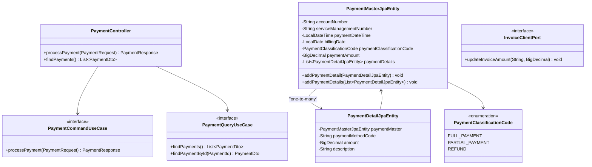
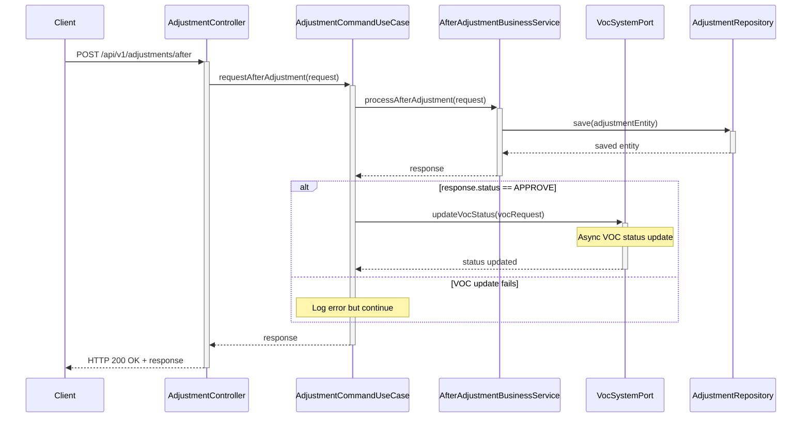
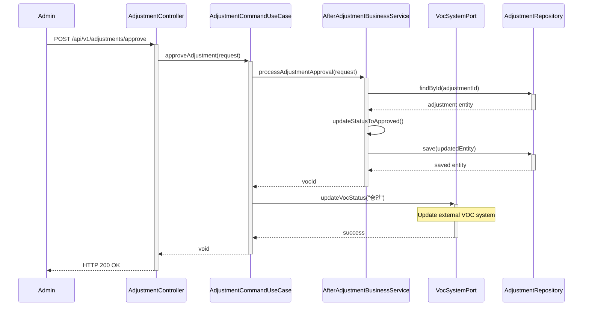
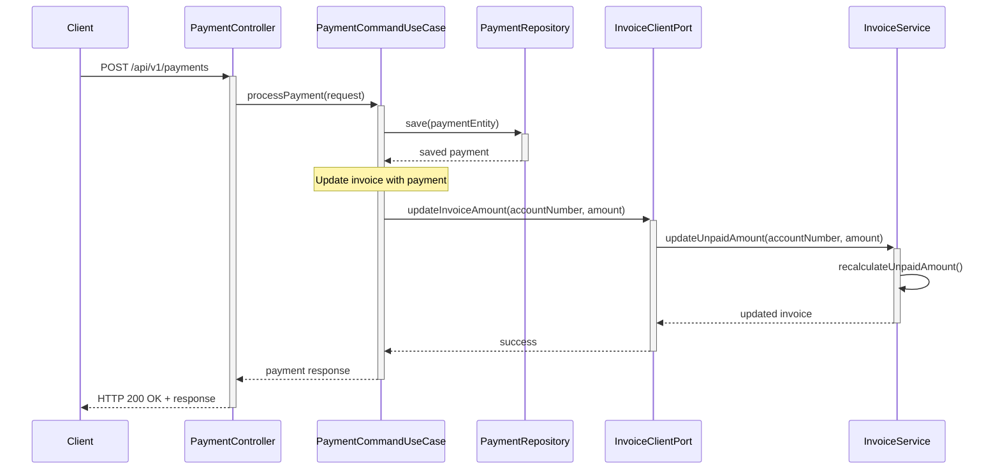
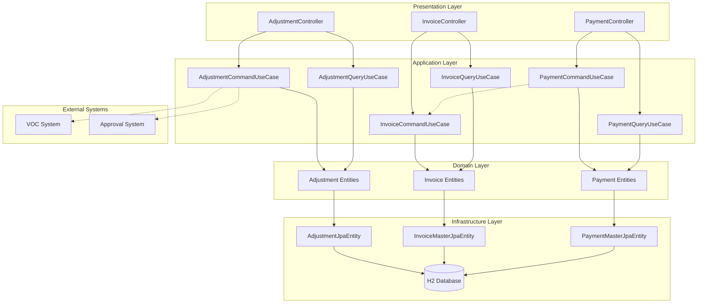
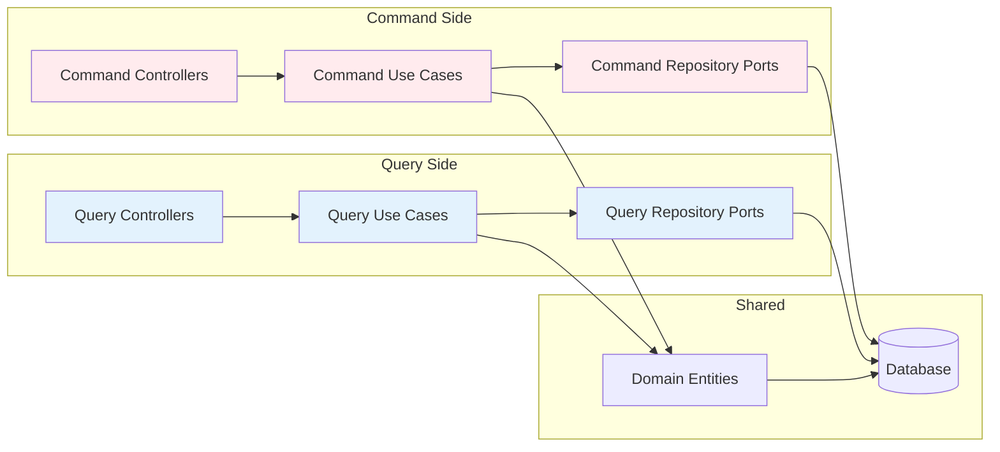

# Telco Billing System - Mermaid Diagrams

## 1. Overall System Class Diagram

```mermaid
classDiagram
    class AdjustmentController {
        +requestAfterAdjustment(AfterAdjustmentRequest) AfterAdjustmentResponse
        +findByServiceManagementNumber(String) List~AdjustmentDto~
        +approveAdjustment(AdjustmentApprovalRequest) void
        +rejectAdjustment(AdjustmentRejectionRequest) void
        +cancelAdjustment(AdjustmentCancelRequest) void
    }
    
    class AdjustmentCommandUseCase {
        <<interface>>
        +requestAfterAdjustment(AfterAdjustmentRequest) AfterAdjustmentResponse
        +approveAdjustment(AdjustmentApprovalRequest) void
        +rejectAdjustment(AdjustmentRejectionRequest) void
        +cancelAdjustment(AdjustmentCancelRequest) void
    }
    
    class AdjustmentQueryUseCase {
        <<interface>>
        +findByServiceManagementNumber(String) List~AdjustmentDto~
    }
    
    class AdjustmentCommandUseCaseImpl {
        +requestAfterAdjustment(AfterAdjustmentRequest) AfterAdjustmentResponse
        +approveAdjustment(AdjustmentApprovalRequest) void
        +rejectAdjustment(AdjustmentRejectionRequest) void
        +cancelAdjustment(AdjustmentCancelRequest) void
    }
    
    class AdjustmentJpaEntity {
        -AdjustmentId id
        -BigDecimal adjustmentRequestAmount
        -AdjustmentType adjustmentType
        -AdjustmentStatusCode adjustmentStatusCode
        -LocalDateTime adjustmentRequestDateTime
        -AdjustmentReasonCode adjustmentReasonCode
        -String adjustmentReasonPhrase
        -String adjustmentApproveRequestUserId
        -String adjustmentApproveUserId
        -LocalDateTime adjustmentApprovedDateTime
        -String accountNumber
        -LocalDate billingDate
        -String adjustmentRequestId
    }
    
    class InvoiceController {
        +findInvoices() List~InvoiceDto~
        +createInvoice(InvoiceRequest) InvoiceResponse
    }
    
    class InvoiceMasterJpaEntity {
        -String accountNumber
        -LocalDate billingDate
        -String serviceManagementNumber
        -BigDecimal totalBillingAmount
        -BigDecimal billingAmount
        -BigDecimal unpaidAmount
        -BigDecimal adjustmentAmount
        -UnpaidStatusCode unpaidStatusCode
        -List~InvoiceDetailJpaEntity~ invoiceDetails
        -boolean fullyPaidAtOnce
    }
    
    class PaymentController {
        +processPayment(PaymentRequest) PaymentResponse
        +findPayments() List~PaymentDto~
    }
    
    class PaymentMasterJpaEntity {
        -String accountNumber
        -String serviceManagementNumber
        -LocalDateTime paymentDateTime
        -LocalDate billingDate
        -PaymentClassificationCode paymentClassificationCode
        -BigDecimal paymentAmount
        -List~PaymentDetailJpaEntity~ paymentDetails
        +addPaymentDetail(PaymentDetailJpaEntity) void
        +addPaymentDetails(List~PaymentDetailJpaEntity~) void
    }
    
    class VocSystemPort {
        <<interface>>
        +updateVocStatus(VocStatusUpdateRequest) void
    }
    
    class InvoiceClientPort {
        <<interface>>
        +updateInvoiceAmount(String, BigDecimal) void
    }
    
    class ApprovalClientPort {
        <<interface>>
        +requestApproval(ApprovalRequest) void
    }

    %% Relationships
    AdjustmentController --> AdjustmentCommandUseCase
    AdjustmentController --> AdjustmentQueryUseCase
    AdjustmentCommandUseCaseImpl ..|> AdjustmentCommandUseCase
    AdjustmentCommandUseCaseImpl --> VocSystemPort
    AdjustmentCommandUseCaseImpl --> ApprovalClientPort
    
    InvoiceController --> InvoiceCommandUseCase
    InvoiceController --> InvoiceQueryUseCase
    
    PaymentController --> PaymentCommandUseCase
    PaymentController --> PaymentQueryUseCase
    
    InvoiceMasterJpaEntity --> InvoiceDetailJpaEntity : "one-to-many"
    PaymentMasterJpaEntity --> PaymentDetailJpaEntity : "one-to-many"
```

## 2. Adjustment Domain - Detailed Class Diagram

```mermaid
classDiagram
    class AdjustmentController {
        +requestAfterAdjustment(AfterAdjustmentRequest) AfterAdjustmentResponse
        +approveAdjustment(AdjustmentApprovalRequest) void
        +rejectAdjustment(AdjustmentRejectionRequest) void
        +cancelAdjustment(AdjustmentCancelRequest) void
    }
    
    class VocSystemAdapter {
        +updateVocStatus(VocStatusUpdateRequest) void
    }
    
    class ApprovalClientAdapter {
        +requestApproval(ApprovalRequest) void
    }
    
    class InvoiceClientAdapter {
        +updateInvoiceAmount(String, BigDecimal) void
    }
    
    class AdjustmentCommandUseCaseImpl {
        +requestAfterAdjustment(AfterAdjustmentRequest) AfterAdjustmentResponse
        +approveAdjustment(AdjustmentApprovalRequest) void
        +rejectAdjustment(AdjustmentRejectionRequest) void
        +cancelAdjustment(AdjustmentCancelRequest) void
    }
    
    class AdjustmentQueryUseCaseImpl {
        +findByServiceManagementNumber(String) List~AdjustmentDto~
    }
    
    class AfterAdjustmentBusinessService {
        +processAfterAdjustment(AfterAdjustmentRequest) AfterAdjustmentResponse
        +processAdjustmentApproval(AdjustmentApprovalRequest) String
        +processAdjustmentRejection(AdjustmentRejectionRequest) String
        +processAdjustmentCancelation(AdjustmentCancelRequest) String
    }
    
    class AdjustmentStatusCode {
        <<enumeration>>
        PENDING
        APPROVED
        REJECTED
        CANCELLED
    }
    
    class AdjustmentType {
        <<enumeration>>
        DISCOUNT
        REFUND
        WAIVER
    }
    
    class AdjustmentReasonCode {
        <<enumeration>>
        SYSTEM_ERROR
        CUSTOMER_COMPLAINT
        BILLING_ERROR
    }
    
    class AdjustmentJpaEntity {
        -AdjustmentId id
        -BigDecimal adjustmentRequestAmount
        -AdjustmentType adjustmentType
        -AdjustmentStatusCode adjustmentStatusCode
        -LocalDateTime adjustmentRequestDateTime
    }
    
    class AdjustmentId {
        -String serviceManagementNumber
        -String adjustmentRequestId
    }
    
    class AdjustmentCommandUseCase {
        <<interface>>
        +requestAfterAdjustment(AfterAdjustmentRequest) AfterAdjustmentResponse
        +approveAdjustment(AdjustmentApprovalRequest) void
        +rejectAdjustment(AdjustmentRejectionRequest) void
        +cancelAdjustment(AdjustmentCancelRequest) void
    }
    
    class AdjustmentQueryUseCase {
        <<interface>>
        +findByServiceManagementNumber(String) List~AdjustmentDto~
    }
    
    class VocSystemPort {
        <<interface>>
        +updateVocStatus(VocStatusUpdateRequest) void
    }
    
    class ApprovalClientPort {
        <<interface>>
        +requestApproval(ApprovalRequest) void
    }
    
    class InvoiceClientPort {
        <<interface>>
        +updateInvoiceAmount(String, BigDecimal) void
    }
    
    %% Port implementations
    AdjustmentCommandUseCaseImpl ..|> AdjustmentCommandUseCase
    AdjustmentQueryUseCaseImpl ..|> AdjustmentQueryUseCase
    VocSystemAdapter ..|> VocSystemPort
    ApprovalClientAdapter ..|> ApprovalClientPort
    InvoiceClientAdapter ..|> InvoiceClientPort
    
    %% Dependencies
    AdjustmentController --> AdjustmentCommandUseCase
    AdjustmentController --> AdjustmentQueryUseCase
    AdjustmentCommandUseCaseImpl --> AfterAdjustmentBusinessService
    AdjustmentCommandUseCaseImpl --> VocSystemPort
    
    %% Domain relationships
    AdjustmentJpaEntity --> AdjustmentStatusCode
    AdjustmentJpaEntity --> AdjustmentType
    AdjustmentJpaEntity --> AdjustmentReasonCode
    AdjustmentJpaEntity --> AdjustmentId
```

## 3. Invoice Domain - Class Diagram

## 4. Payment Domain - Class Diagram

## 5. Adjustment Request Process - Sequence Diagram

## 6. Adjustment Approval Workflow - Sequence Diagram

## 7. Cross-Domain Payment Processing - Sequence Diagram

## 8. System Architecture Overview

## 9. CQRS Pattern Implementation

